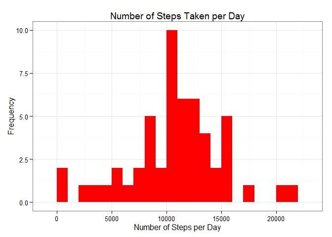
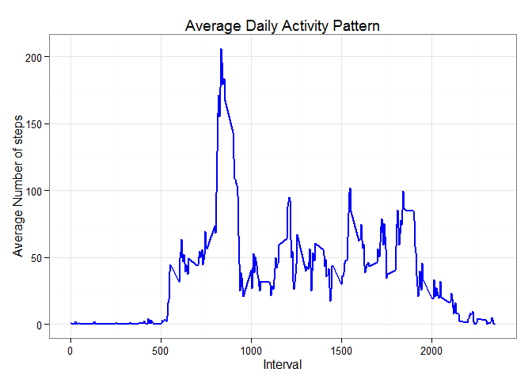

# Reproducible Research: Peer Assessment 1

This assignment makes use of data from a personal activity monitoring device. This device collects data at 5 minute intervals through out the day. The data consists of two months of data from an anonymous individual collected during the months of October and November, 2012 and include the number of steps taken in 5 minute intervals each day.
The variables included in this dataset are:

.	steps: Number of steps taking in a 5-minute interval (missing values are coded as NA)

.	date: The date on which the measurement was taken in YYYY-MM-DD format

.	interval: Identifier for the 5-minute interval in which measurement was taken


## Loading and preprocessing data


```r
library(knitr)
opts_chunk$set(echo = TRUE, results = 'hold')
library(data.table)
library(lubridate)
```

```
## 
## Attaching package: 'lubridate'
## 
## The following objects are masked from 'package:data.table':
## 
##     hour, mday, month, quarter, wday, week, yday, year
```

```r
library(ggplot2) 
# Set working directory 
setwd("C:\\z_DATAJHU2015\\ReproducibleResearch201501\\Project1")
ActDat <- read.csv('activity.csv', header = TRUE, sep = ",",
                  colClasses=c("numeric", "character", "numeric"))

ActDat$date <- as.Date(ActDat$date, format = "%Y-%m-%d")
ActDat$interval <- as.factor(ActDat$interval)
StepPerDay <- aggregate(steps ~ date, ActDat, sum)
colnames(StepPerDay) <- c("date","steps")
```


## Mean total number of steps taken per day?
For this part of the assignment, we ignore the missing values in the dataset.


1.	Histogram of the total number of steps taken each day


```r
ggplot(StepPerDay, aes(x = steps)) + 
	geom_histogram(fill = "red", binwidth = 1000) + 
        labs(title="Number of Steps Taken per Day", 
             	x = "Number of Steps per Day", y = "Frequency") + 
		theme_bw()    
```

 

2.	Calculate and report the mean and median total number of steps taken per day

Mean total number of steps taken per day

```r
StepMean = round(mean(StepPerDay$steps, na.rm=TRUE))
print(StepMean)
```

```
## [1] 10766
```

Median total number of steps taken per day

```r
StepMedian = round(median(StepPerDay$steps, na.rm=TRUE))
print(StepMedian)
```

```
## [1] 10765
```

## Average daily activity pattern?
1.	Time series plot (i.e. type = "l") of the 5-minute interval (x-axis) and the average number of steps taken, averaged across all days (y-axis)


```r
StepPerInterval <- aggregate(ActDat$steps, 
                                by = list(interval = ActDat$interval),
                                FUN=mean, na.rm=TRUE)

# Convert to integers for faster plotting
StepPerInterval$interval <- as.integer(levels(StepPerInterval$interval)[StepPerInterval$interval])
colnames(StepPerInterval) <- c("interval", "steps")

ggplot(StepPerInterval, aes(x=interval, y=steps)) +   
        geom_line(color="blue", size=1) +  
        labs(title="Average Daily Activity Pattern", x="Interval", y="Average Number of steps") +  
        theme_bw()
```

 

2.	The 5-minute interval containing the maximum number of steps and the number of steps it contains


```r
MAXInterval <- StepPerInterval[which.max(  
        StepPerInterval$steps),]
print(MAXInterval)
```

```
##     interval    steps
## 104      835 206.1698
```

